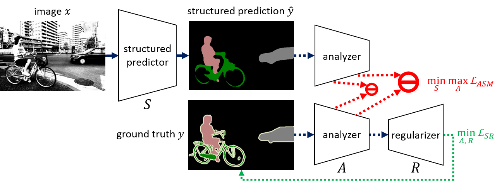

# Adversarial Structure Matching for Structured Prediction Tasks

By [Jyh-Jing Hwang*](https://jyhjinghwang.github.io/), [Tsung-Wei Ke*](https://www1.icsi.berkeley.edu/~twke/), [Jianbo Shi](https://www.cis.upenn.edu/~jshi/), 
and [Stella X. Yu](http://www1.icsi.berkeley.edu/~stellayu/) (* equal contribution)



Pixel-wise losses, e.g., cross-entropy or L2, have been widely used in structured prediction tasks 
as a spatial extension of generic image classification or regression. However, its i.i.d. assumption 
neglects the structural regularity present in natural images. Various attempts have been made to 
incorporate structural reasoning mostly through structure priors in a cooperative way where co-occurring 
patterns are encouraged. 

We, on the other hand, approach this problem from an opposing angle and propose 
a new framework, Adversarial Structure Matching (ASM), for training such structured prediction networks 
via an adversarial process, in which we train a structure analyzer that provides the supervisory signals, 
the ASM loss. The structure analyzer is trained to maximize the ASM loss, or to emphasize recurring multiscale 
hard negative structural mistakes among co-occurring patterns. On the contrary, the structured prediction 
network is trained to reduce those mistakes and is thus enabled to distinguish fine-grained structures. 
As a result, training structured prediction networks using ASM reduces contextual confusion among objects 
and improves boundary localization. We demonstrate that our ASM outperforms pixelwise IID loss or structural 
prior GAN loss on three different structured prediction tasks: semantic segmentation, monocular depth 
estimation, and surface normal prediction.

ASM is published in CVPR 2019, see [our paper](http://openaccess.thecvf.com/content_CVPR_2019/papers/Hwang_Adversarial_Structure_Matching_for_Structured_Prediction_Tasks_CVPR_2019_paper.pdf) for more details.

## Prerequisites

1. Linux
2. Python2.7 or Python3 (>=3.5)
3. Cuda 8.0 and Cudnn 6

## Required Python Packages

1. tensorflow >= 1.4
2. numpy
3. scipy
4. tqdm
5. PIL
6. opencv

## Data Preparation

* [Stanford 2D3DS](http://buildingparser.stanford.edu/dataset.html)

We provide python script to down-sample images, as depicted in the paper.
```
python pyscripts/preprocess/stanford_scenes_down_sample.py\
  --data_dir /path/to/Stanford/2D3DS/dir \
  --new_dir /path/to/down-sampled/Stanford/2D3DS/dir
```

## Trained Models

* Stanford 2D3DS Surface Normal Estimation (fold 1)

| Loss | Mean | Median | <= 2.82 | <= 5.65 | <= 11.25 | <= 22.5 | <= 30 |
| ---- | :---: | :---: | :---: | :---: | :---: | :---: | :---: |
| [IID](https://drive.google.com/drive/folders/1DtTGR2NAcDf31BxKofwfYV8Y0zQ9w4eB?usp=sharing)  | 16.84 | 9.20 | 12.90 | 31.12 | 58.01 | 77.37 | 82.76 |
| [cGAN](https://drive.google.com/drive/folders/1KifmHkcchzkiMWilahVP_6jQL-Iaz5_X?usp=sharing)  | 17.12 | 9.04 | 12.28 | 31.52 | 58.52 | 77.00 | 82.32 |
| [ASM](https://drive.google.com/drive/folders/1Oa36LXwMGY_ambCEuyVNuq40WVGyovvl?usp=sharing)  | 16.98 | 8.28 | 17.58 | 35.48 | 63.29 | 78.50 | 82.47 |

## Validation Results
* Stanford 2D3DS Surface Normal Estimation (fold 1)
([IID](https://drive.google.com/open?id=1HFYKsoSJFOCqa8B4SuRJ5M16ek4E3ZwH), [ASM](https://drive.google.com/open?id=12b03x0sylw1570v7PN4yQSUhTAy7jb5x))

## Training

* IID:
```
python pyscripts/train/train_stanford_scenes.py
```

* cGAN:
```
python pyscripts/train/train_stanford_scenes_cgan.py
```

* ASM
```
python pyscripts/train/train_stanford_scenes_asm.py
```

## Inference

* Single-Scale Input only
```
python pyscripts/inference/inference_stanford_scenes.py
```

## Benchmarking

* Surface Normal
```
python pyscripts/benchmark/benchmark_stanford_scenes.py
```

## Bashscripts for Suface Normal Estimation on Stanford 2D3DS

* IID:
```
bash bashscripts/stanford_scenes/normal/train.sh
```

* cGAN:
```
bash bashscripts/stanford_scenes/normal/train_cgan.sh
```

* ASM
```
bash bashscripts/stanford_scenes/normal/train_asm.sh
```

## Citation
If you find this code useful for your research, please consider citing our paper [Adversarial Structure Matching for Structured Prediction Tasks](https://arxiv.org/abs/1805.07457).

```
@inproceedings{asm2019,
  title={Adversarial Structure Matching for Structured Prediction Tasks},
  author={Hwang, Jyh-Jing and Ke, Tsung-Wei and Shi, Jianbo and Yu, Stella X},
  booktitle={Proceedings of the IEEE Conference on Computer Vision and Pattern Recognition},
  pages={4056--4065},
  year={2019}
}
```

## License
ASM is released under the MIT License (refer to the LICENSE file for details).
